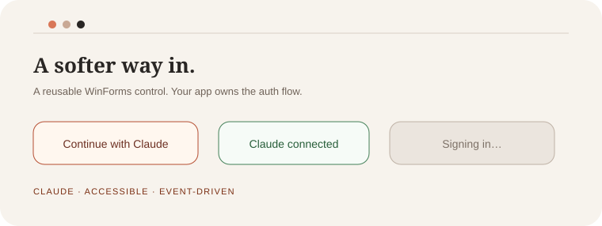

# CLAUDE-LoginButton

<p align="center">
  
</p>

<p align="center">
  <strong>A Claude-styled, reusable WinForms login surface with a live Claude chat host.</strong><br />
  <sub>Independent · host-owned auth · not affiliated with Anthropic</sub>
</p>

<p align="center">
  <a href="https://github.com/nnn747375-cloud/CLAUDE-LoginButton/actions/workflows/ci.yml"></a>
  
  
  
</p>

## Use the real button

The repository contains two deliberate modes:

- `python -m http.server 4173 --directory docs` opens a credential-free UI preview.
- `node examples/LocalHost/server.mjs` starts a real local host. The button runs
  Anthropic's official `ant auth login` OAuth flow and the chat sends real
  Messages API requests without exposing the credential to the browser.

Install the official [`ant` CLI](https://platform.claude.com/docs/en/cli-sdks-libraries/cli/quickstart) first. GitHub Pages is not enabled because this repository is private.

## The important boundary

This repository contains a UI control plus an optional host-side integration.
The control never stores credentials. `ClaudeCliAuthProvider` delegates login
to the official `ant` CLI, and `ClaudeMessagesClient` sends requests from the
host process after the host has received a credential.

That separation keeps the control reusable and prevents credentials from
leaking into a UI library.

## What is included

- `ClaudeLoginButton`: signed-out, signing-in, connected and error states
- `ClaudeCliAuthProvider`: real browser OAuth through the official `ant` CLI
- `ClaudeApiKeyAuthProvider`: host-side API-key mode for secret managers
- `ClaudeMessagesClient`: real Claude Messages API client
- keyboard activation, visible focus and accessible naming
- Claude-inspired mark, typography and state styling with no provider credential handling
- a credential-free browser preview with a small local mini chat
- a live local browser host and a WinForms demo with real chat requests
- source project, documentation and CI build

## Requirements

- Windows 10 or newer
- .NET 9 Windows Forms
- the official `ant` CLI for browser OAuth, or a host-managed API key
- an exact, configured callback/redirect URI
- secure session storage owned by the host application

## Install from source

```bash
git clone https://github.com/nnn747375-cloud/CLAUDE-LoginButton.git
dotnet build CLAUDE-LoginButton/src/ClaudeLoginButton/ClaudeLoginButton.csproj
```

Or add the project reference to your WinForms application:

```xml
<ProjectReference Include="path/to/ClaudeLoginButton.csproj" />
```

## Five-minute WinForms integration

```csharp
using ClaudeLoginButton;

var auth = new ClaudeCliAuthProvider();
ClaudeAuthSession? session = null;
var button = new ClaudeLoginButton
{
    Dock = DockStyle.Top,
};
var chat = new ClaudeMessagesClient(_ =>
    session is null
        ? Task.FromException<ClaudeCredential>(new InvalidOperationException("Not connected."))
        : Task.FromResult(session.Credential));

button.LoginRequested += async (_, _) =>
{
    button.SetSigningIn();

    try
    {
        session = await auth.SignInAsync();
        button.SetConnected(session.AccountLabel);
    }
    catch (OperationCanceledException)
    {
        button.SetSignedOut();
    }
    catch (Exception)
    {
        button.SetError();
        // Log only redacted diagnostics.
    }
};

button.LogoutRequested += async (_, _) =>
{
    await auth.SignOutAsync();
    session = null;
    button.SetSignedOut();
};

Controls.Add(button);
```

Then call `await chat.SendAsync([new ClaudeMessage("user", "Hello")]);` from
your message handler. Use `await` through the auth flow; do not call `.Wait()`
or `.Result` on the WinForms UI thread.

## Expected flow

1. The user activates the button.
2. `ant auth login` opens the official Claude Console OAuth flow.
3. The CLI stores the provider-managed credential locally and refreshes it when needed.
4. The host asks the CLI for a short-lived access token.
5. Only then does the host call `SetConnected(...)` and send Messages API requests.

A button click is never proof of authentication.

## Security checklist

- generate fresh `state` and PKCE values for every attempt
- validate the callback exactly once
- register exact redirect URIs; do not accept arbitrary destinations
- never embed a client secret in a desktop executable
- never put codes or tokens in logs, URLs, screenshots or analytics
- store credentials in an appropriate secure store
- request only the permissions your host actually needs
- treat cancellation, expiry and denial as separate outcomes

Read the full [security boundary](docs/security.md).

## Demos

The browser preview in `docs/` has interactive UI states and local replies; it
does not contact a provider or contain credentials. Run it with:

```bash
python -m http.server 4173 --directory docs
```

Then open `http://localhost:4173`.

The WinForms demo uses the official `ant` CLI and the live Messages API:

```bash
dotnet run --project examples/WinFormsDemo/WinFormsDemo.csproj
```

For the browser's live path, run:

```bash
node examples/LocalHost/server.mjs
```

Then open `http://127.0.0.1:4173` and click `Continue with Claude`. See the
[local host guide](examples/LocalHost/README.md) for API-key mode and security
details.

For another host-owned live flow, configure the browser adapter before loading
the page:

```html
<script>
  window.CLAUDE_AUTH_URL = "/auth/start";
  window.CLAUDE_AUTH_STATUS_URL = "/auth/status";
  window.CLAUDE_AUTH_LOGOUT_URL = "/auth/logout";
  window.CLAUDE_CHAT_ENDPOINT = "/api/chat";
</script>
```

Those endpoints must run server-side. Do not put an Anthropic API key in a
static page; see the [Claude API authentication docs](https://platform.claude.com/docs/en/manage-claude/authentication).

## Troubleshooting

**Clicking does nothing:** confirm the control is in the active form and that
`LoginRequested` is subscribed.

**The callback is not received:** verify scheme, host, port, path and trailing
slash against the registered redirect URI. Check firewall, proxy and port use.

**The UI freezes:** remove `.Wait()`/`.Result` from the UI thread and await the
auth service from the event boundary.

**The app remains disconnected:** call `SetConnected(...)` only after your app
has validated issuer, audience, expiry, permissions and session state.

## Repository boundary

This repo deliberately excludes the local ClaudeLocal desktop app, chat
history, account data, browser profiles, tokens, cookies and any auth backend.

## License

MIT. Claude and Anthropic are trademarks of Anthropic PBC. This project is
independent and is not endorsed by or affiliated with Anthropic.
