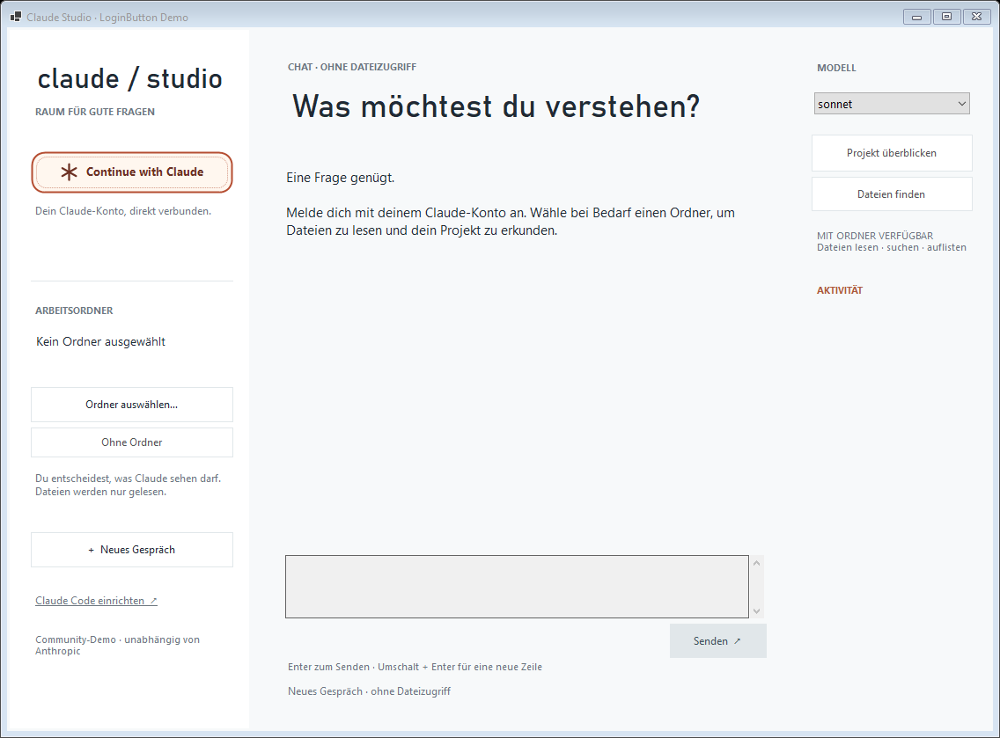

# Claude LoginButton

A reusable Windows Forms sign-in control and **Claude Studio**, a quiet desktop demo for conversations and read-only project exploration through the official Claude Code CLI.

Independent community project. Not affiliated with Anthropic.



## Start the demo

1. Install the [.NET 9 SDK](https://dotnet.microsoft.com/download/dotnet/9.0) and [Claude Code](https://code.claude.com/docs/en/setup) on Windows 10/11. Claude Code **2.1.248 or newer**, with `--restricted` and `--safe-mode`, is required. The demo checks those capabilities before use. Native installation needs no Node.js; official npm installations also work.
2. Double-click **`Start-Demo.cmd`** (or `Launch.cmd`). It builds the source and opens Claude Studio.
3. Click **Continue with Claude**. Your existing Claude subscription login is reused. If you are signed out, the official browser sign-in opens and the demo waits for completion.
4. Send a message. Optionally choose a trusted folder to enable **Read, Glob and Grep**. Tool activity appears in the right-hand rail.

Browser sign-in still requires you to finish the provider's account/consent steps. An eligible Claude Pro, Max, Team or Enterprise account and remaining account usage are required; this is not free API access. A signed-in label verifies account status, not available model capacity. The first real message verifies inference access.

If your browser cannot reach the CLI's local callback, finish `claude auth login --claudeai` in a terminal and reconnect. This demo never asks for or displays auth codes, cookies or tokens.

```powershell
# Alternative to Launch.cmd
dotnet run --project examples/WinFormsDemo/WinFormsDemo.csproj
```

## What works

- One-button account connection, automatic official browser login when needed, and explicit cancellation.
- Real chat with the selected model and CLI `--resume` conversation continuity.
- A chosen workspace enables file reading, listing and searching. With no folder selected, all tools are disabled.
- Live tool names and completion/error events; readable, selectable conversation text without fixed-height clipping.
- Stop, retryable errors, Enter to send, Shift+Enter for a newline, keyboard/screen-reader activation, and resizing.
- New conversation, folder changes and model changes reset the conversation. Failed or canceled requests leave the draft ready to retry and start a fresh conversation on the next send.

## File access and privacy

`--restricted` confines built-in file tools to the working directory. The demo exposes only `Read,Glob,Grep`, with `dontAsk` permission mode; it does not offer write, shell, browser or web tools and never bypasses permissions. `--safe-mode` and `--strict-mcp-config` prevent ordinary user/project hooks, plugins, instructions and MCP servers from being loaded. Administrator-managed policy still applies.

Prompts are sent over UTF-8 stdin, not inserted into shell commands. API-key/cloud-provider overrides are removed from the child process environment so this demo uses the CLI's subscription login. Npm launchers are resolved to Node's official CLI entry point without `cmd.exe` prompt interpolation.

Claude Code owns credentials and may persist conversation transcripts under its normal local storage to support `--resume`. Disconnect and New conversation clear this demo's state; they do not erase CLI transcripts or sign other apps out. Messages and selected file contents used by tools are sent to the Claude service under your account.

## Use in your app

Reference `src/ClaudeLoginButton/ClaudeLoginButton.csproj`. The existing `IClaudeAuthProvider`, `ClaudeCliAuthProvider` alias, control state/events and `SendAsync(history)` API remain available.

```csharp
var auth = new ClaudeCodeCliAuthProvider();
using var cancellation = new CancellationTokenSource();
var account = await auth.SignInAsync(cancellation.Token);

var client = new ClaudeCodeClient
{
    WorkspacePath = chosenFolder, // null: no tools
    Model = "sonnet"
};
var progress = new Progress<ClaudeActivity>(activity => ShowActivity(activity));
var first = await client.SendTurnAsync("Explain this project", progress: progress,
    cancellationToken: cancellation.Token);
var next = await client.SendTurnAsync("Which file should I read first?", first.SessionId,
    progress, cancellation.Token);
```

Treat session IDs as belonging to one selected workspace/account. The demo clears them on folder or account changes. Use `CancellationToken` for Stop and form close. Subscription usage limits, network errors and unsupported models are reported as errors rather than successful responses.

## Verification

```powershell
dotnet build examples/WinFormsDemo/WinFormsDemo.csproj -c Release
dotnet run --project tests/SmokeTests/SmokeTests.csproj -c Release
# Optional real service test: requires a valid login and consumes account usage
dotnet run --project tests/SmokeTests/SmokeTests.csproj -c Release -- --live
```

The deterministic harness launches a separate fixture process and checks UTF-8 prompt transport, real process cancellation/timeouts, tool-event parsing, session continuation, auth branching, exit-zero error results and missing responses. Fixtures do not prove service access. `--live` creates a temporary text fixture, requests a real Read tool call, then verifies a second turn remembers its content.

Validated on Windows: Release build and 12 offline protocol checks passed. Native layout and keyboard/accessibility were inspected at normal/minimum window sizes, including a long selectable transcript. **Fresh account sign-in is required. Successful live inference, real tool execution and continuation remain unverified; further Claude live testing is deferred at the owner's request.**

## Official references

- [CLI commands, authentication status and restricted mode](https://code.claude.com/docs/en/cli-reference)
- [Account types and browser authentication](https://code.claude.com/docs/en/authentication)
- [Installation and updates](https://code.claude.com/docs/en/setup)

MIT license. See [SECURITY.md](SECURITY.md) for reporting security issues.
